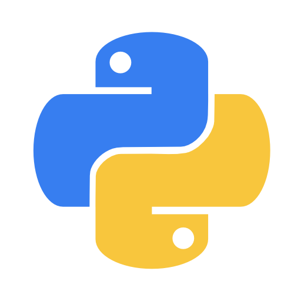

# Hi! I'm Santiago Viscoso 👋

👨‍💻 **Python Dev** | 🛡️ **Cybersecurity Student**

---

### 👤 About Me
- 🎓 Currently studying **Cybersecurity**.
- 🐍 Focused on software development and automation with **Python**.
- 🚀 Building custom scripts, automation tools, and personal projects in my free time.

### 💻 Technologies & Core Skills
<table>
  <tr>
    <td align="center" width="96">
       Python
    </td>
    <td align="center" width="96">
       Linux
    </td>
  </tr>
</table>

- ⚙️ **Focus:** Task Automation | Software Development | Custom Scripting

### 📚 Currently Learning
- 🔍 **Network Security & Packet Analysis** (Analizando tráfico con herramientas o scripts).
- 🛡️ **Ethical Hacking Fundamentals** (Bases de pruebas de penetración y seguridad).
- 🚀 **Advanced Automation** (Mejorando la lógica de mis scripts en Python).
